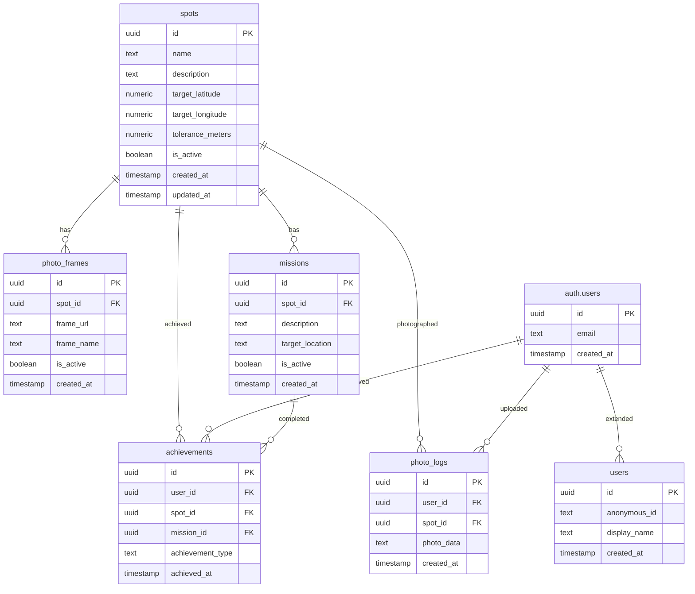

# GeoPuzzle データベース設定

## データベース構成

### テーブル定義

#### 1. spots（観光スポット情報）
| カラム名 | 型 | 制約 | 説明 |
|---------|------|------|------|
| id | uuid | PRIMARY KEY | スポットID |
| name | text | NOT NULL | スポット名 |
| description | text | NOT NULL | スポット説明 |
| target_latitude | numeric | NOT NULL | ピタッと判定用緯度 |
| target_longitude | numeric | NOT NULL | ピタッと判定用経度 |
| tolerance_meters | numeric | NOT NULL | 許容誤差（メートル） |
| is_active | boolean | NOT NULL DEFAULT true | アクティブフラグ |
| created_at | timestamp with time zone | NOT NULL DEFAULT now() | 作成日時 |
| updated_at | timestamp with time zone | NOT NULL DEFAULT now() | 更新日時 |

#### 2. photo_frames（フォトフレーム情報）
| カラム名 | 型 | 制約 | 説明 |
|---------|------|------|------|
| id | uuid | PRIMARY KEY | フレームID |
| spot_id | uuid | NOT NULL REFERENCES spots(id) | スポットID（外部キー） |
| frame_url | text | NOT NULL | フレーム画像URL |
| frame_name | text | NOT NULL | フレーム名 |
| is_active | boolean | NOT NULL DEFAULT true | アクティブフラグ |
| created_at | timestamp with time zone | NOT NULL DEFAULT now() | 作成日時 |

#### 3. missions（ミッション情報）
| カラム名 | 型 | 制約 | 説明 |
|---------|------|------|------|
| id | uuid | PRIMARY KEY | ミッションID |
| spot_id | uuid | NOT NULL REFERENCES spots(id) | スポットID（外部キー） |
| description | text | NOT NULL | ミッション説明 |
| target_location | text | 目標場所 |
| is_active | boolean | NOT NULL DEFAULT true | アクティブフラグ |
| created_at | timestamp with time zone | NOT NULL DEFAULT now() | 作成日時 |

#### 4. users（ユーザー情報）
※ Supabase Authのauth.usersテーブルを使用しますが、追加情報が必要な場合は以下のテーブルを作成

| カラム名 | 型 | 制約 | 説明 |
|---------|------|------|------|
| id | uuid | PRIMARY KEY REFERENCES auth.users(id) | ユーザーID（外部キー） |
| anonymous_id | text | 匿名ID |
| display_name | text | 表示名 |
| created_at | timestamp with time zone | NOT NULL DEFAULT now() | 作成日時 |

#### 5. achievements（達成状況）
| カラム名 | 型 | 制約 | 説明 |
|---------|------|------|------|
| id | uuid | PRIMARY KEY | 達成ID |
| user_id | uuid | NOT NULL REFERENCES auth.users(id) | ユーザーID（外部キー） |
| spot_id | uuid | REFERENCES spots(id) | スポットID（外部キー） |
| mission_id | uuid | REFERENCES missions(id) | ミッションID（外部キー） |
| achievement_type | text | NOT NULL | 達成タイプ（position/mission） |
| achieved_at | timestamp with time zone | NOT NULL DEFAULT now() | 達成日時 |

#### 6. photo_logs（写真ログ）
| カラム名 | 型 | 制約 | 説明 |
|---------|------|------|------|
| id | uuid | PRIMARY KEY | 写真ログID |
| user_id | uuid | NOT NULL REFERENCES auth.users(id) | ユーザーID（外部キー） |
| spot_id | uuid | NOT NULL REFERENCES spots(id) | スポットID（外部キー） |
| photo_data | text | NOT NULL | 写真データ（Base64） |
| created_at | timestamp with time zone | NOT NULL DEFAULT now() | 作成日時 |

## ER図



## テーブル作成SQL

SupabaseのSQL Editorに以下のSQLを貼り付けて実行してください。

```sql
-- 拡張機能の有効化（必要な場合）
CREATE EXTENSION IF NOT EXISTS "uuid-ossp";

-- spotsテーブル作成
CREATE TABLE spots (
    id UUID PRIMARY KEY DEFAULT uuid_generate_v4(),
    name TEXT NOT NULL,
    description TEXT NOT NULL,
    target_latitude NUMERIC NOT NULL,
    target_longitude NUMERIC NOT NULL,
    tolerance_meters NUMERIC NOT NULL DEFAULT 0.1,
    is_active BOOLEAN NOT NULL DEFAULT true,
    created_at TIMESTAMP WITH TIME ZONE NOT NULL DEFAULT NOW(),
    updated_at TIMESTAMP WITH TIME ZONE NOT NULL DEFAULT NOW()
);

-- photo_framesテーブル作成
CREATE TABLE photo_frames (
    id UUID PRIMARY KEY DEFAULT uuid_generate_v4(),
    spot_id UUID NOT NULL REFERENCES spots(id) ON DELETE CASCADE,
    frame_url TEXT NOT NULL,
    frame_name TEXT NOT NULL,
    is_active BOOLEAN NOT NULL DEFAULT true,
    created_at TIMESTAMP WITH TIME ZONE NOT NULL DEFAULT NOW()
);

-- missionsテーブル作成
CREATE TABLE missions (
    id UUID PRIMARY KEY DEFAULT uuid_generate_v4(),
    spot_id UUID NOT NULL REFERENCES spots(id) ON DELETE CASCADE,
    description TEXT NOT NULL,
    target_location TEXT,
    is_active BOOLEAN NOT NULL DEFAULT true,
    created_at TIMESTAMP WITH TIME ZONE NOT NULL DEFAULT NOW()
);

-- usersテーブル作成（Supabase Authの拡張）
CREATE TABLE users (
    id UUID PRIMARY KEY REFERENCES auth.users(id) ON DELETE CASCADE,
    anonymous_id TEXT,
    display_name TEXT,
    created_at TIMESTAMP WITH TIME ZONE NOT NULL DEFAULT NOW()
);

-- achievementsテーブル作成
CREATE TABLE achievements (
    id UUID PRIMARY KEY DEFAULT uuid_generate_v4(),
    user_id UUID NOT NULL REFERENCES auth.users(id) ON DELETE CASCADE,
    spot_id UUID REFERENCES spots(id) ON DELETE CASCADE,
    mission_id UUID REFERENCES missions(id) ON DELETE CASCADE,
    achievement_type TEXT NOT NULL CHECK (achievement_type IN ('position', 'mission')),
    achieved_at TIMESTAMP WITH TIME ZONE NOT NULL DEFAULT NOW()
);

-- photo_logsテーブル作成
CREATE TABLE photo_logs (
    id UUID PRIMARY KEY DEFAULT uuid_generate_v4(),
    user_id UUID NOT NULL REFERENCES auth.users(id) ON DELETE CASCADE,
    spot_id UUID NOT NULL REFERENCES spots(id) ON DELETE CASCADE,
    photo_data TEXT NOT NULL,
    created_at TIMESTAMP WITH TIME ZONE NOT NULL DEFAULT NOW()
);

-- updated_atの自動更新関数作成
CREATE OR REPLACE FUNCTION update_updated_at_column()
RETURNS TRIGGER AS $$
BEGIN
    NEW.updated_at = NOW();
    RETURN NEW;
END;
$$ language 'plpgsql';

-- spotsテーブルのupdated_at自動更新トリガー
CREATE TRIGGER update_spots_updated_at BEFORE UPDATE ON spots
    FOR EACH ROW EXECUTE FUNCTION update_updated_at_column();

-- インデックス作成
CREATE INDEX idx_spots_is_active ON spots(is_active);
CREATE INDEX idx_photo_frames_spot_id ON photo_frames(spot_id);
CREATE INDEX idx_photo_frames_is_active ON photo_frames(is_active);
CREATE INDEX idx_missions_spot_id ON missions(spot_id);
CREATE INDEX idx_missions_is_active ON missions(is_active);
CREATE INDEX idx_achievements_user_id ON achievements(user_id);
CREATE INDEX idx_achievements_spot_id ON achievements(spot_id);
CREATE INDEX idx_achievements_mission_id ON achievements(mission_id);
CREATE INDEX idx_photo_logs_user_id ON photo_logs(user_id);
CREATE INDEX idx_photo_logs_spot_id ON photo_logs(spot_id);

-- サンプルデータ挿入（開発用）
INSERT INTO spots (name, description, target_latitude, target_longitude, tolerance_meters) VALUES
('海王丸', '海王丸のベスト構図位置。数cm精度でピタッと立ってください。', 36.5944, 136.6444, 0.1);

-- サンプルフォトフレーム
INSERT INTO photo_frames (spot_id, frame_url, frame_name) VALUES
((SELECT id FROM spots WHERE name = '海王丸'), 'https://example.com/frame1.jpg', '週替わりフレーム1');

-- サンプルミッション
INSERT INTO missions (spot_id, description, target_location) VALUES
((SELECT id FROM spots WHERE name = '海王丸'), '内川商店街まで歩いてください', '内川商店街');
```

## RLS（Row Level Security）設定

### RLS有効化SQL

```sql
-- 全テーブルでRLSを有効化
ALTER TABLE spots ENABLE ROW LEVEL SECURITY;
ALTER TABLE photo_frames ENABLE ROW LEVEL SECURITY;
ALTER TABLE missions ENABLE ROW LEVEL SECURITY;
ALTER TABLE users ENABLE ROW LEVEL SECURITY;
ALTER TABLE achievements ENABLE ROW LEVEL SECURITY;
ALTER TABLE photo_logs ENABLE ROW LEVEL SECURITY;
```

### RLSポリシー設定SQL

```sql
-- spotsテーブルのポリシー
-- 全ユーザーがアクティブなスポットを読み取り可能
CREATE POLICY "Active spots are viewable by everyone"
    ON spots FOR SELECT
    USING (is_active = true);

-- photo_framesテーブルのポリシー
-- 全ユーザーがアクティブなフォトフレームを読み取り可能
CREATE POLICY "Active photo frames are viewable by everyone"
    ON photo_frames FOR SELECT
    USING (is_active = true);

-- missionsテーブルのポリシー
-- 全ユーザーがアクティブなミッションを読み取り可能
CREATE POLICY "Active missions are viewable by everyone"
    ON missions FOR SELECT
    USING (is_active = true);

-- usersテーブルのポリシー
-- ユーザーは自分の情報のみ読み取り可能
CREATE POLICY "Users can view own profile"
    ON users FOR SELECT
    USING (auth.uid() = id);

-- 認証ユーザーは自分のユーザー情報を作成可能
CREATE POLICY "Users can insert own profile"
    ON users FOR INSERT
    WITH CHECK (auth.uid() = id);

-- ユーザーは自分の情報のみ更新可能
CREATE POLICY "Users can update own profile"
    ON users FOR UPDATE
    USING (auth.uid() = id);

-- achievementsテーブルのポリシー
-- ユーザーは自分の達成状況のみ読み取り可能
CREATE POLICY "Users can view own achievements"
    ON achievements FOR SELECT
    USING (auth.uid() = user_id);

-- 認証ユーザーは自分の達成状況を作成可能
CREATE POLICY "Users can insert own achievements"
    ON achievements FOR INSERT
    WITH CHECK (auth.uid() = user_id);

-- photo_logsテーブルのポリシー
-- ユーザーは自分の写真ログのみ読み取り可能
CREATE POLICY "Users can view own photo logs"
    ON photo_logs FOR SELECT
    USING (auth.uid() = user_id);

-- 認証ユーザーは自分の写真ログを作成可能
CREATE POLICY "Users can insert own photo logs"
    ON photo_logs FOR INSERT
    WITH CHECK (auth.uid() = user_id);
```

### 管理者用ポリシー（必要な場合）

```sql
-- 管理者用関数作成
CREATE OR REPLACE FUNCTION is_admin()
RETURNS BOOLEAN AS $$
BEGIN
    -- 管理者判定ロジック（例：特定のメールアドレス）
    RETURN EXISTS (
        SELECT 1 FROM auth.users
        WHERE id = auth.uid()
        AND email = 'admin@example.com'
    );
END;
$$ LANGUAGE plpgsql SECURITY DEFINER;

-- 管理者は全データを読み取り可能
CREATE POLICY "Admins can view all spots"
    ON spots FOR SELECT
    USING (is_admin());

CREATE POLICY "Admins can view all photo frames"
    ON photo_frames FOR SELECT
    USING (is_admin());

CREATE POLICY "Admins can view all missions"
    ON missions FOR SELECT
    USING (is_admin());

CREATE POLICY "Admins can view all users"
    ON users FOR SELECT
    USING (is_admin());

CREATE POLICY "Admins can view all achievements"
    ON achievements FOR SELECT
    USING (is_admin());

CREATE POLICY "Admins can view all photo logs"
    ON photo_logs FOR SELECT
    USING (is_admin());

-- 管理者は全データを更新可能
CREATE POLICY "Admins can update all spots"
    ON spots FOR ALL
    USING (is_admin());

CREATE POLICY "Admins can update all photo frames"
    ON photo_frames FOR ALL
    USING (is_admin());

CREATE POLICY "Admins can update all missions"
    ON missions FOR ALL
    USING (is_admin());
```
